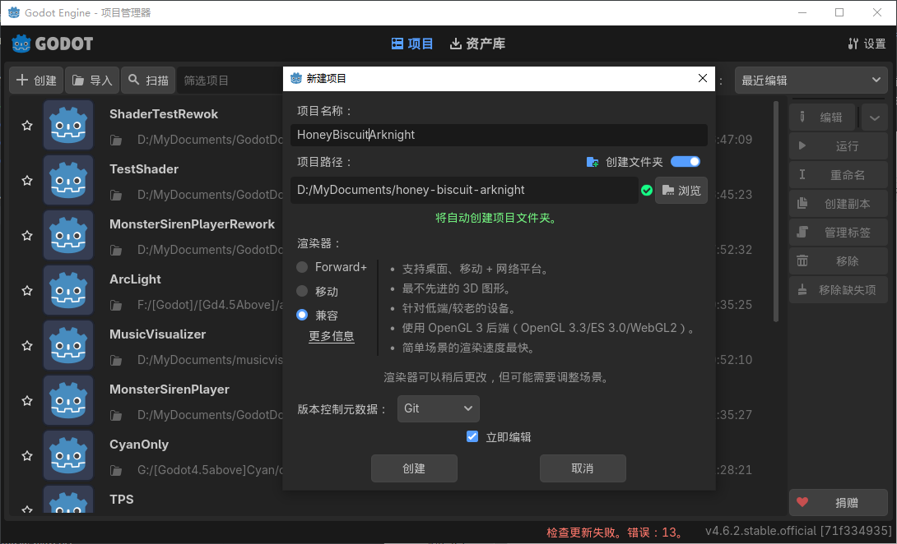
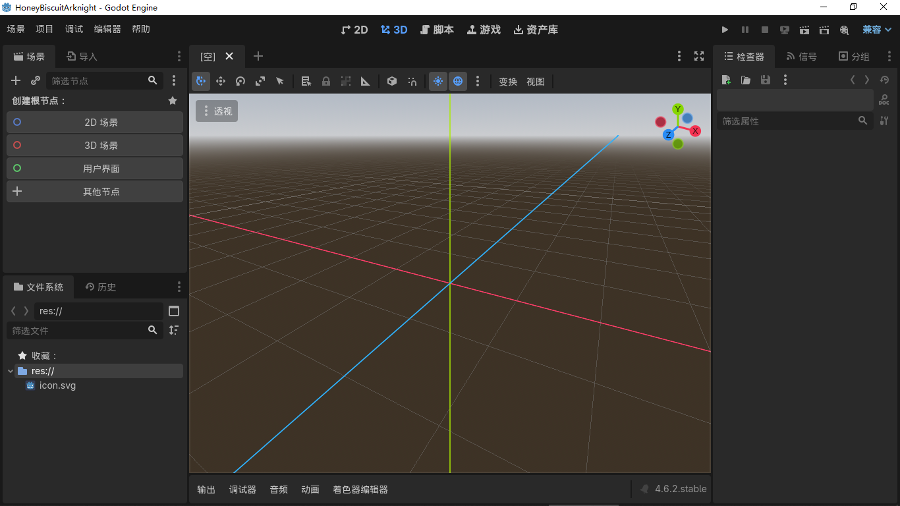
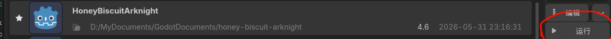
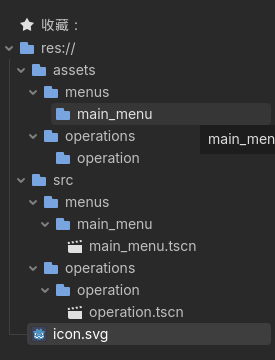
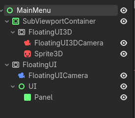

<h1>如何借助godot来创建自己的游戏/视觉小说/二创</h1>
<h2>以项目《明日方舟》二创《溟日纺粥》为例<h2>

---

本文将通过项目《溟日纺粥》来简略介绍如何通过godot来创建自己的游戏/视觉小说/二创。

### 目录

>    - [Chapter 1](#chapter-1)
>        - [前言](#前言)
>        - [下载及安装](#下载及安装)
>        - [开始之前](#开始之前)
>    - [Chapter 2](#chapter-2)
>        - [全局基本逻辑实现](#全局基本逻辑实现)
>        - [实现主界面](#实现主界面)
>        - [实现选人界面及结算界面]
>        - [实现战斗场景]
>    - [Chapter 3]()
>        - [剧情基本逻辑]
>        - [实现剧情界面]
    
---

## Chapter 1 {#chapter-1}

---

### 前言 {#前言}

本文目的为激发兴趣及提供入门的指导，若想进行进一步的学习，请自行学习相关知识。
1附：作者本身水平有限，方案实现可能并不好，仅供参考。

当前进度：

- [] [Chapter 1](#chapter-1)
    - [x] [前言](#前言)
    - [x] [下载及安装](#下载及安装)
    - [x] [开始之前](#开始之前)
- [] [Chapter 2](#chapter-2)
    - [] [全局基本逻辑实现](#全局基本逻辑实现)
    - [] [实现主界面](#实现主界面)
    - [] [实现选人界面及结算界面]
    - [] [实现战斗场景]
- [] [Chapter 3]()
    - [] [剧情基本逻辑]
    - [] [实现剧情界面]

---

### 下载及安装 {#下载及安装}

可至官方网站[https://godotengine.org/zh-cn/](https://godotengine.org/zh-cn/)进行下载。

目前godot存在两个版本，分别使用gdscript和c#作为使用语言（不过貌似c#版也可使用gdscript）。若只使用gdscript或为初学者则推荐使用gdscript版.（如图2-2）

*图2-1 4.6.2版本主页面*

*图2-2 4.6.2windows下载界面*
*其中.Net版即为使用c#语言的版本*

此处编者采用gdscript版作为示例：

*图2-3 下载好的压缩包*

然后解压到一个文件夹中（建议放在桌面或其他容易找的地方，因为这其实就是godot的应用程序了，之后都是用它打开）
之后只需打开那个文件夹打开其中的.exe即可
（也许你注意到还有一个后缀为console的.exe，那其实是godot的命令行版本，godot支持命令行调用，但此处我们用不上）

*图2-4 解压出来的应用程序*

---

### 开始之前 {#开始之前}

>
>本项目将会在github开源，项目素材来源于明日方舟，从prts.wiki获取，遵守cc by-nc-sa 4.0协议（见页脚）。
>本项目的绝大部分机制来源于明日方舟，从prts.wiki获取，遵守cc by-nc-sa 4.0协议（见页脚）。
>
>相关机制可至prts.wiki查看，如[作战机制 - PRTS - 玩家共同构筑的明日方舟中文Wiki](https://prts.wiki/w/%E4%BD%9C%E6%88%98%E6%9C%BA%E5%88%B6#%E7%AC%A6%E6%96%87)
>和[游戏数据基础 - PRTS - 玩家共同构筑的明日方舟中文Wiki](https://prts.wiki/w/%E6%B8%B8%E6%88%8F%E6%95%B0%E6%8D%AE%E5%9F%BA%E7%A1%80)
>

当你打开godot后，默认语言设置应该是你的系统语言，大部分情况下为中文，如果不是可以点击右上角的Settings/设置更改Language/语言选项

点击左上角的创建按钮，便可以创建一个项目（如图3-1）（很不幸，由于电脑配置被判定为超小杯，只能使用兼容模式，实际情况下选移动和forward+更好）

 *图3-1 密饼，好耶！小刻，desu！*

然后你大概就会看到这个画面

 *图3-2 好大的字体*

之后再次打开godot只需从项目列表里选中即可

 *图3-3 被烂尾的项目吓哭*

---

## Chapter 2 {#chapter-2}

### 全局基本逻辑实现 {#全局基本逻辑实现}

也许你会问：不会代码怎么办，怎么直接开始实现逻辑了。
问的好，其实我也不知道为啥是这个结构（）

当然这一节主要是根据wiki上的属性，转换成项目中的代码等等，可以考虑先跳过这一节，等后续章节提到相关机制再回来看即可（也许我会写个链接）

*（其实这一节是边做后面边写的）*

首先，项目分为几个主场景/Scenes，分别是MainMenu，Operation，（TODO）
我们可以先在项目中创建好对应的文件夹和场景

 *图4-1 创建好的结构1*

---

### 实现主界面 {#实现主界面}

显然，想要一个游戏可以玩，至少得有一个能够使用的ui。

>本项目关于ui的设计，大多参考明日方舟自身的设计。

首先，我们便可以注意到明日方舟主界面的ui是一个可以晃动的ui，我们立刻想到使用godot的[*viewport*](https://docs.godotengine.org/zh-cn/4.x/tutorials/rendering/viewports.html)节点来进行一个trick，方便我们不用手动计算偏移（虽然会很屎山，但效果好）
结构大致如图。

 *图4-2 后续会微调结构以达到效果，并且会使用代码进行计算角度，好像也不是很方便（*